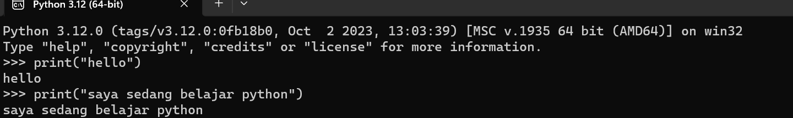
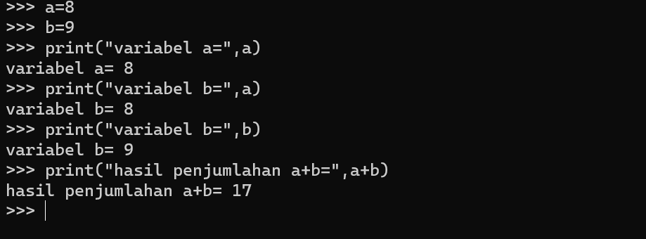
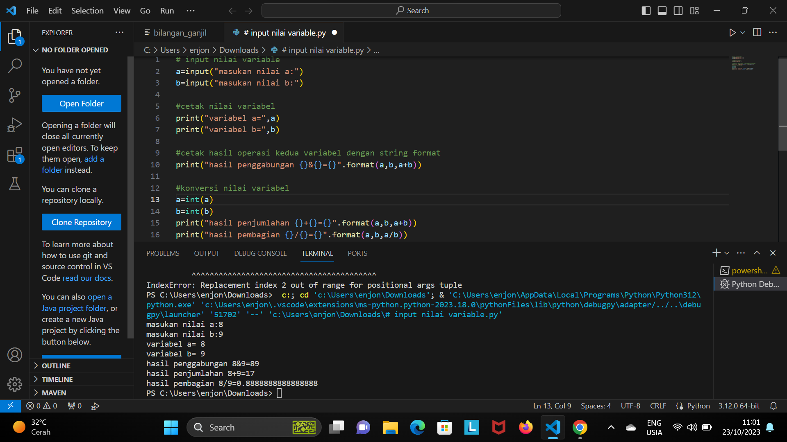

<h1>latihan 1</h1>

Menampilkan hello di layar

Menampilkan tulisan Saya sedang Belajar Python

<h1>latihan 2</h1>

Menjumlahkan 2 buah bilangan menggunakan variabel a dan b

mendefinisikan variabel a dengan 8

mendefinisikan variabel b dengan 9

mencetak variabel a dan b

mencetak hasil penjumlahan a+b

<h1>latihan 3</h1>

Menjalankan IDLE

• Membuat file baru dengan nama latihan3.py (pastikan lokasi file
pada folder lab2py pada direktori kerja anda)
• Menggunakan fungsi input untuk mengambil nilai variabel dari
keyboard.

